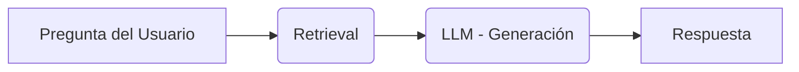
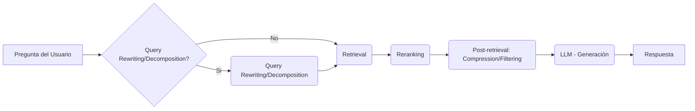
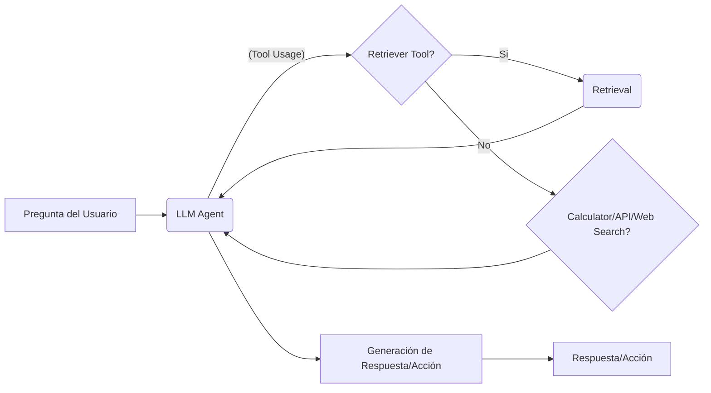

# Arquitecturas RAG en Producción: De Pipelines Naive a Agentes Autónomos

Bienvenido a esta masterclass técnica sobre arquitecturas Retrieval-Augmented Generation (RAG) para entornos empresariales. Tras cubrir los cimientos de la preparación de datos, embeddings, recuperación y evaluación, profundizaremos en arquitecturas completas, abarcando desde el enfoque más básico hasta sistemas agentic con capacidades de toma de decisiones.  El objetivo es proporcionar una guía práctica para ingenieros de ML y arquitectos que buscan implementar soluciones RAG robustas y escalables.

## 1. Arquitectura Naive RAG: La Base del Pipeline

La arquitectura Naive RAG representa el punto de partida más simple: un pipeline lineal de recuperación y generación.



*   **Retrieve:** Se consulta el índice vectorial (o híbrido) basándose en la pregunta del usuario.
*   **Generate:** El LLM recibe la pregunta y los documentos recuperados como contexto, generando la respuesta.

**Limitaciones:** Esta arquitectura es efectiva para preguntas sencillas y directas que pueden ser respondidas directamente con la información recuperada. Sin embargo, sufre de varias limitaciones:

*   **Preguntas Multi-Hop:** Incapaz de combinar información de múltiples documentos para responder preguntas que requieren inferencia.
*   **Validación de Resultados:**  No valida la relevancia o precisión de los documentos recuperados antes de alimentar al LLM, propensa a alucinaciones o respuestas incorrectas.
*   **Decisión de Búsqueda:**  No tiene la capacidad de decidir si es necesario realizar una búsqueda o si la respuesta puede ser generada a partir del conocimiento previo del LLM.

## 2. Arquitectura Modular/Advanced RAG: Un Enfoque Flexible

Para abordar las limitaciones de la arquitectura Naive, la arquitectura Modular RAG introduce una estructura más flexible y componible.



*   **Pre-Retrieval:** Opcional.  Incluye Query Rewriting (reformulación de la pregunta para mejorar la precisión de la búsqueda) y/o Decomposition (división de preguntas complejas en subpreguntas). HyDE (Hugging Face's Decomposition) es una técnica común aquí.
*   **Retrieval:** Usa una estrategia híbrida (vectorial + RRF) y aplica reranking (Cross-encoders, ColBERT) para refinar los resultados.
*   **Post-Retrieval:** Opcional.  Incluye Compresión (resumen de los documentos recuperados) y/o Filtering (eliminación de documentos irrelevantes).

Esta arquitectura modular permite intercambiar o ajustar componentes individuales para optimizar el rendimiento sin afectar el resto del pipeline. Esto mejora la precisión, reduce la latencia (con compresión) y maneja preguntas más complejas.

**Ejemplo de Configuración YAML (Modular RAG):**

```yaml
retrieval_strategy: hybrid
reranking_model: "cross-encoder/ms-marco-distilbert-base-v2"
query_rewriting:
  enabled: true
  model: "meta-llama/Llama-2-7b-chat-hf"
post_retrieval_compression:
  enabled: true
  model: "facebook/bart-large-cnn"
```

## 3. Arquitectura Agentic RAG: El LLM como Director

La arquitectura Agentic RAG lleva la flexibilidad al siguiente nivel, otorgando al LLM el rol de orquestador. El LLM ahora tiene acceso a una variedad de "herramientas", incluyendo el retriever, una calculadora, APIs externas, y acceso a web search.



El agente opera en un loop de razonamiento (e.g., ReAct), donde evalúa si necesita utilizar una herramienta o puede responder directamente.  Esto permite la capacidad de re-consultar, refinar la búsqueda o incluso decidir que no puede responder a la pregunta con la información disponible.

## 4. Patrones Concretos: Elevando el RAG Agentic

Varios patrones concretos mejoran el rendimiento y la robustez de las arquitecturas Agentic.

*   **Corrective RAG (CRAG):** El LLM evalúa la relevancia de los documentos recuperados. Si los considera insuficientes o irrelevantes, reformula la pregunta y realiza una nueva búsqueda.
*   **Self-RAG:** El modelo decide cuándo recuperar información basándose en un "token de reflexión" que indica la necesidad de más contexto.
*   **Multi-Agent RAG:** Se utilizan múltiples agentes especializados en diferentes dominios o documentos. Estos agentes colaboran para responder preguntas complejas, compartiendo información y conocimientos.

## 5. Frameworks en 2026: El Ecosistema de Agentes RAG

Varios frameworks facilitan la implementación de arquitecturas RAG avanzadas.

*   **LangGraph:** Orientado a la construcción de pipelines gráficos complejos y flujos de trabajo, ideal para aplicaciones que requieren un alto grado de control y personalización.
*   **LlamaIndex Agents:** Ofrece una abstracción de alto nivel para la creación de agentes RAG, simplificando la integración de herramientas y la definición de estrategias de toma de decisiones.
*   **CrewAI:** Se enfoca en la creación de equipos de agentes colaborativos, perfecto para tareas que requieren experiencia en múltiples dominios.
*   **Haystack Agents:**  Provee una plataforma robusta para construir y desplegar aplicaciones RAG, con herramientas para el manejo de datos, la recuperación y la generación.

**Cuándo usar cada uno:** LangGraph para control granular, LlamaIndex Agents para simplicidad, CrewAI para colaboración multi-agente, Haystack Agents para un enfoque completo.

## 6. Trade-offs de Producción

Implementar arquitecturas Agentic conlleva compromisos importantes.

*   **Latencia:** Los loops de razonamiento incrementan la latencia en comparación con arquitecturas Naive.
*   **Coste:** Más llamadas al LLM aumentan el coste operativo.
*   **Previsibilidad:** El comportamiento de los agentes es menos predecible que el de un pipeline lineal, complicando el testeo y debugging.
*   **Cuándo NO usar Agentic:** Para preguntas sencillas que pueden ser respondidas directamente con información recuperada, el coste y la complejidad no justifican su uso.

## 7. Errores Comunes

*   **Sobrecarga Agentic:** Usar arquitecturas Agentic para casos simples innecesariamente.
*   **Loops Infinitos:** Falta de límites de iteración en los loops de razonamiento.
*   **Falta de Logging:** No registrar las decisiones del agente, dificultando el debugging y la mejora del rendimiento.

En resumen, la evolución de las arquitecturas RAG nos permite abordar preguntas cada vez más complejas y crear sistemas de conocimiento más robustos y flexibles. Sin embargo, es crucial considerar los trade-offs asociados y evitar errores comunes para garantizar una implementación exitosa y eficiente. La selección del framework adecuado dependerá de los requisitos específicos del caso de uso y el nivel de control deseado.
